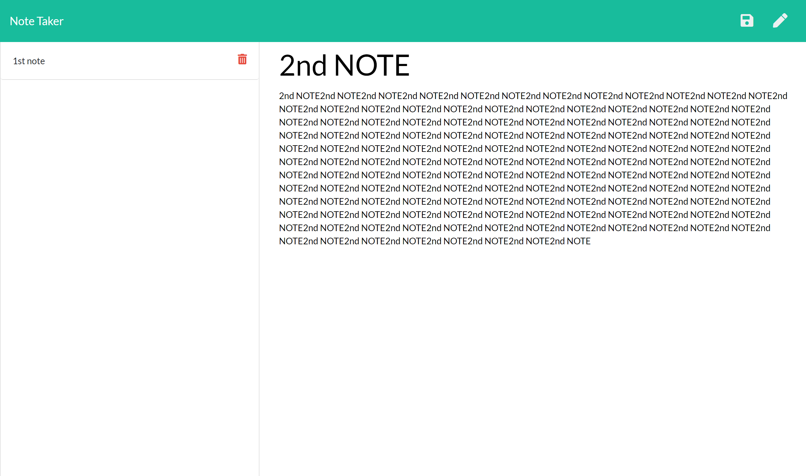

# Note-Taker

# Project Title

  <h1 align="center">Note Taker 👋</h1>

  <p align="center">
    
    
    
    
</p>

<p align="center">
    
    
    
    
    
    
</p>

# Description

  

  
# Table of Contents

* [Installation](#-Installation)
* [Usage](#-Usage)
* [License](#-Installation)
* [Link to the App](#-Link-to-the-app)
* [Tests](#-Tests)
* [Questions](#-Contact-Information)

## User Story

```
AS A small business owner
I WANT to be able to write and save notes
SO THAT I can organize my thoughts and keep track of tasks I need to complete
```


## Acceptance Criteria

```
GIVEN a note-taking application
WHEN I open the Note Taker
THEN I am presented with a landing page with a link to a notes page
WHEN I click on the link to the notes page
THEN I am presented with a page with existing notes listed in the left-hand column, plus empty fields to enter a new note title and the note’s text in the right-hand column
WHEN I enter a new note title and the note’s text
THEN a Save icon appears in the navigation at the top of the page
WHEN I click on the Save icon
THEN the new note I have entered is saved and appears in the left-hand column with the other existing notes
WHEN I click on an existing note in the list in the left-hand column
THEN that note appears in the right-hand column
WHEN I click on the Write icon in the navigation at the top of the page
THEN I am presented with empty fields to enter a new note title and the note’s text in the right-hand column
```

# Installation

  please type npm install on terminal to install the application.
  Then node server.js to start the server, and go to local Host:3000
  Or just follow the heroku application

# Usage

Create notes on the go.

## Screenshot



## License

  Licensed under MIT.<br/>
  For more information, visit this link.<br/>
  <https://opensource.org/licenses/MIT>
  
# Link to the app

 (<https://note-tracker2662.herokuapp.com/>)

# Tests

 none done .

# Contact Information

* GitHub Username: MichaelPappas2662
* Contact Email: email@email.com
  